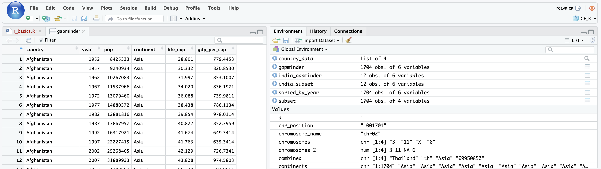

```{r, include = FALSE}
source("../bin/chunk-options.R")
knitr_fig_path("03-")
```

## Working with spreadsheets (tabular data)

A substantial amount of the data is tabular in form, this is data arranged in rows and columns - also known as spreadsheets. We could write a whole lesson on how to work with spreadsheets effectively ([actually we did](https://datacarpentry.org/organization-genomics/)). For our purposes, we want to remind you of a few principles before we work with our first set of example data:

**1) Keep raw data separate from analyzed data**

This is principle number one because if you can't tell which files are the original raw data, you risk making some serious mistakes (e.g. drawing conclusion from data which have been manipulated in some unknown way).

**2) Keep spreadsheet data Tidy**

The simplest principle of **Tidy data** is that we have one row in our spreadsheet for each observation or sample, and one column for every variable that we measure or report on. As simple as this sounds, it's very easily violated. Most data scientists agree that significant amounts of their time is spent tidying data for analysis. Read more about data organization in [our lesson](https://datacarpentry.org/organization-genomics/) and in [this paper](https://www.jstatsoft.org/article/view/v059i10).

**3) Trust but verify**

Finally, while you don't need to be paranoid about data, you should have a plan for how you will prepare it for analysis. **This a focus of this lesson.** You probably already have a lot of intuition, expectations, assumptions about your data - the range of values you expect, how many values should have been recorded, etc. Of course, as the data get larger our human ability to keep track will start to fail (and yes, it can fail for small data sets too). R will help you to examine your data so that you can have greater confidence in your analysis, and its reproducibility.

> ## Tip: Keeping you raw data separate
>
> When you work with data in R, you are not changing the original file you loaded that data from. This is different than (for example) working with a spreadsheet program where changing the value of the cell leaves you one "save"-click away from overwriting the original file. You have to purposely use a writing function (e.g. `write.csv()`) to save data loaded into R. In that case, be sure to save the manipulated data into a new file. More on this later in the lesson.


## Importing tabular data into R

There are several ways to import data into R. For our purpose here, we will focus on using the tools every R installation comes with (so called "base" R) to import a comma-delimited file containing the results of our variant calling workflow. We will need to load the sheet using a function called `read.csv()`.

> ## Exercise: Review the arguments of the `read.csv()` function
>
> **Before using the `read.csv()` function, use R's help feature to answer the following questions**.
>
> *Hint*: Entering '?' before the function name and then running that line will bring up the help documentation. Also, when reading this particular help be careful to pay attention to the 'read.csv' expression under the 'Usage' heading. Other answers will be in the 'Arguments' heading.
>
> 1. What is the default parameter for 'header' in the `read.csv()` function?
> 2. What argument would you have to change to read a file that was delimited by semicolons (;) rather than commas?
> 3. What argument would you have to change to read file in which numbers used commas for decimal separation (i.e. 1,00)?
> 4. What argument would you have to change to read in only the first 10,000 rows of a very large file?

<details>
<summary>Solution</summary>

1. The `read.csv()` function has the argument 'header' set to TRUE by default, this means the function always assumes the first row is header information, (i.e. column names)
2. The `read.csv()` function has the argument 'sep' set to ",". This means the function assumes commas are used as delimiters, as you would expect. Changing this parameter (e.g. `sep=";"`) would now interpret semicolons as delimiters.
3. Although it is not listed in the `read.csv()` usage, `read.csv()` is a "version" of the function `read.table()` and accepts all its arguments. If you set `dec=","` you could change the decimal operator. We'd probably assume the delimiter is some other character.
4. You can set `nrow` to a numeric value (e.g. `nrow=10000`) to choose how many rows of a file you read in. This may be useful for very large files where not all the data is needed to test some data cleaning steps you are applying.

Hopefully, this exercise gets you thinking about using the provided help documentation in R. There are many arguments that exist, but which we wont have time to cover. Look here to get familiar with functions you use frequently, you may be surprised at what you find they can do.
</details>
<br>

Now, let's read in the file `data/gapminder_data.csv` which will be located in `/home/user/CF_R/data/gapminder_data.csv`. Call this data `gapminder`. The first argument to pass to our `read.csv()` function is the file path for our data. The file path must be in quotes and now is a good time to remember to use tab autocompletion. **If you use tab autocompletion you avoid typos and errors in file paths.** Use it!

```{r, eval = FALSE, purl = FALSE}
## read in a CSV file and save it as 'gapminder'

gapminder <- read.csv("/home/user/CF_R/data/gapminder_data.csvdata/gapminder_data.csv")
```


```{r, echo = FALSE, eval = TRUE, purl = FALSE}
## silently read in CSV file from FigShare

gapminder <- read.csv("/home/workshop/rcavalca/CF_R/data/gapminder_data.csv")
```

One of the first things you should notice is that in the Environment window, you have the `gapminder` object, listed as 1704 obs. (observations/rows) of 6 variables (columns). Double-clicking on the name of the object will open a view of the data in a new tab.



## Summarizing, subsetting, and determining the structure of a data frame.

A **data frame is the standard way in R to store tabular data**. A data fame could also be thought of as a collection of vectors, all of which have the same length. Using only two functions, we can learn a lot about out data frame including some summary statistics as well as well as the "structure" of the data frame. Let's examine what each of these functions can tell us:

```{r, purl = FALSE}
## get summary statistics on a data frame

summary(gapminder)
```

Our data frame had 6 variables, so we get 6 fields that summarize the data. The `year`, `pop`, `lifeExp` and `gyearPercap` variables are numerical data and so you get summary statistics on the min and max values for these columns, as well as mean, median, and interquartile ranges. The other variables, `country` and `continent`, are treated as characters data (more on this in a bit).

There is a lot to work with, so we will subset the first three columns into a new data frame using the `data.frame()` function.

```{r, purl = FALSE}
## put the first three columns of gapminder into a new data frame called subset

subset <- data.frame(gapminder[,c(1:3,6)])
```

Now, let's use the `str()` (structure) function to look a little more closely at how data frames work:

```{r, purl = FALSE}
## get the structure of a data frame

str(subset)
```

Ok, thats a lot up unpack! Some things to notice.

- the object type `data.frame` is displayed in the first row along with its dimensions, in this case 1704 observations (rows) and 4 variables (columns)
- Each variable (column) has a name (e.g. `country`). This is followed by the object mode (e.g. chr, int, etc.). Notice that before each variable name there is a `$` - this will be important later.

## Introducing Factors

Factors are the final major data structure we will introduce in our R genomics lessons. Factors can be thought of as vectors which are specialized for categorical data. Given R's specialization for statistics, this make sense since categorial and continuous variables are usually treated differently. Sometimes you may want to have data treated as a factor, but in other cases, this may be undesirable.

Let's see the value of treating variables, some of which are categorical in nature, as factors. Let's take a look at just the continents.

```{r, purl = FALSE}
## extract the "continent" column to a new object

continents <- gapminder$continent
```

Let's take a look at continents and see what we get:

```{r, purl = FALSE}
continents
```

There are 1704 continents (one for each row), and it looks like a lot of them are repeated. Let's determine what the unique values are.

```{r, purl = FALSE}
unique(continents)
```

This leaves us with just 5 continents. Right now, they are being treated as characters, but we could treat them as categories (after all, the name and number of continents is fixed). Doing this will have some nice downstream effects. Let's try to generate a plot of the `continents` character vector as it is right now:

```{r, error = TRUE, purl = FALSE, fig.show='hide'}
plot(continents)
```

Whoops! Though the `plot()` function will do its best to give us a quick plot, it is unable to do so here. One way to fix this it to tell R to treat the continents as categories (i.e. a factor vector); we will create a new object to avoid confusion using the `factor()` function:

```{r, purl = FALSE}
factor_continents <- factor(continents)
```

Let's learn a little more about this new type of vector:


```{r, purl = FALSE}
str(factor_continents)
```

The categories ("Africa", "Americas", etc.) of the factor are returned; these are called "Levels". **Levels are the different categories contained in a factor**. By default, R will organize the levels in a factor in alphabetical order. So the first level in this factor is "Africa".

For the sake of efficiency, R stores the content of a factor as a vector of integers, where an integer is assigned to each of the possible levels. We can see that by the output:

~~~
Factor w/ 5 levels "Africa","Americas",..: 3 3 3 3 3 3 3 3 3 3 ...
~~~

But why does `str()` display `3 3 3 3 3 ...`? Let's take a look at the head of `factor_continents`:

```{r, purl = FALSE}
head(factor_continents)
```

We see repeated values of "Asia". Notice the levels of the factor are also displayed, and "Asia" is the third in the list, hence the 3.

We can see how many items in our vector fall into each category:

```{r, purl = FALSE}
summary(factor_continents)
```

As you can imagine, this is useful when you want to generate a tally.

> ## Tip: treating objects as categories without changing their mode
>
> You don't have to make an object a factor to get the benefits of treating an object as a factor. See what happens when you use the `as.factor()` function on `continents`. To generate a tally, you can sometimes also use the `table()` function; though sometimes you may need to combine both (i.e. `table(as.factor(object))`)

## Plotting and ordering factors

One of the most common uses for factors will be when you plot categorical values. For example, suppose we want to know how many of our gapminder had each possible SNP we could generate a plot:

```{r, purl = FALSE}
plot(factor_continents)
```

This isn't a particularly spectacular example of a plot but it works, and it recapitulates the table from `summary()`. We'll be learning much more about creating nice, publication-quality graphics later in this lesson.

If you recall, factors are ordered alphabetically. That might make sense, but categories (e.g., "red", "blue", "green") often do not have an intrinsic order. What if we wanted to order our plot according to the numerical value (i.e., in ascending order of continent frequency)? We can enforce an order on our factors:

```{r, purl = FALSE}
ordered_factor_continents <- factor(factor_continents, levels = names(sort(table(factor_continents))))
```

Let's deconstruct this from the inside out (you can try each of these commands to see why this works):

1. We create a table of `factor_continents` to get the frequency of each continent: `table(factor_continents)`
2. We sort this table: `sort(table(factor_continents))`; use the `decreasing =` parameter for this function if you wanted to change from the default of FALSE
3. Using the `names` function gives us just the character names of the table sorted by frequencies:`names(sort(table(factor_continents)))`
4. The `factor` function is what allows us to create a factor. We give it the `factor_continents` object as input, and use the `levels=` parameter to enforce the ordering of the levels.

Now we see our plot has be reordered:

```{r, purl = FALSE}
plot(ordered_factor_continents)
```

Factors come in handy in many places when using R. Even using more sophisticated plotting packages such as ggplot2 will sometimes require you to understand how to manipulate factors.

## Subsetting data frames

Next, we are going to talk about how you can get specific values from data frames, and where necessary, change the mode of a column of values.

The first thing to remember is that a data frame is two-dimensional (rows and columns). Therefore, to select a specific value we will will once again use `[]` (bracket) notation, but we will specify more than one value (except in some cases where we are taking a range).

> ## Exercise: Subsetting a data frame
>
> Try the following indices and functions and try to figure out what they return.
>
> 1. `gapminder[1,1]`
> 2. `gapminder[2,4]`
> 3. `gapminder[801,29]`
> 4. `gapminder[2, ]`
> 5. `gapminder[-1, ]`
> 6. `gapminder[1:4,1]`
> 7. `gapminder[1:10, c("country","continent")]`
> 8. `gapminder[,c("country")]`
> 9. `head(gapminder)`
> 10. `tail(gapminder)`
> 11. `gapminder$country`
> 12. `gapminder[gapminder$country == "Italy",]`
>
<details>
<summary>Solution</summary>

1.
```{r}
gapminder[1,1]
```
2.
```{r}
gapminder[2,4]
```
3.
```{r}
gapminder[801,29]
```
4.
```{r}
gapminder[2, ]
```
5.
```{r, echo = TRUE, eval = FALSE}
gapminder[-1, ]
```

```{r, echo = FALSE, eval = TRUE}
head(gapminder[-1, ])
```
6.
```{r}
gapminder[1:4,1]
```
7.
```{r}
gapminder[1:10, c("country","continent")]
```
8.
```{r, echo = TRUE, eval = FALSE}
gapminder[,c("country")]
```

```{r, echo = FALSE, eval = TRUE}
head(gapminder[,c("country")])
```
9.
```{r}
head(gapminder)
```
10.
```{r}
tail(gapminder)
```
11..
```{r, echo = TRUE, eval = FALSE}
gapminder$country
```

```{r, echo = FALSE, eval = TRUE}
head(gapminder$country)
```
12.
```{r, echo = TRUE, eval = FALSE}
gapminder[gapminder$country == "Italy",]
```

```{r, echo = FALSE, eval = TRUE}
head(gapminder[gapminder$country == "Italy",])
```
</details>
<br>


The subsetting notation is very similar to what we learned for vectors. The key differences include:

- Typically provide two values separated by commas: data.frame[row, column]
- In cases where you are taking a continuous range of numbers use a colon between the numbers (start:stop, inclusive)
- For a non continuous set of numbers, pass a vector using `c()`
- Index using the name of a column(s) by passing them as vectors using `c()`

Finally, in all of the subsetting exercises above, we printed values to the screen. You can create a new data frame object by assigning them to a new object name:

```{r, purl = FALSE}
# create a new data frame containing only observations from India

india_gapminder <- gapminder[gapminder$country == "India",]

# check the dimension of the data frame

dim(india_gapminder)

# get a summary of the data frame

summary(india_gapminder)
```

## Coercing values in data frames

> ## Tip: coercion isn't limited to data frames
>
> While we are going to address coercion in the context of data frames most of these methods apply to other data structures, such as vectors, as we saw when we coerced a character vector into a factor vector.


Sometimes, it is possible that R will misinterpret the type of data represented in a data frame, or store that data in a mode which prevents you from operating on the data the way you wish. For example, a long list of gene names isn't usually thought of as a categorical variable, the way that your experimental condition (e.g. control, treatment) might be. More importantly, some R packages you use to analyze your data may expect characters as input, not factors. At other times (such as plotting or some statistical analyses) a factor may be more appropriate. Ultimately, you should know how to change the mode of an object.

First, its very important to recognize that coercion happens in R all the time. This can be a good thing when R gets it right, or a bad thing when the result is not what you expect. Consider:

```{r, purl = FALSE}
snp_chromosomes <- c('3', '11', 'X', '6')
typeof(snp_chromosomes)
```

Although there are several numbers in our vector, they are all in quotes, so we have explicitly told R to consider them as characters. However, even if we removed the quotes from the numbers, R would coerce everything into a character:

```{r, purl = FALSE}
snp_chromosomes_2 <- c(3, 11, 'X', 6)
typeof(snp_chromosomes_2)
snp_chromosomes_2[1]
```

We can use the `as.` functions to explicitly coerce values from one form into another. Consider the following vector of characters, which all happen to be valid numbers:

```{r, purl = FALSE}
snp_positions_2 <- c("8762685", "66560624", "67545785", "154039662")
typeof(snp_positions_2)
snp_positions_2[1]
```

Now we can coerce `snp_positions_2` into a numeric type using `as.numeric()`:

```{r, purl = FALSE}
snp_positions_2 <- as.numeric(snp_positions_2)
typeof(snp_positions_2)
snp_positions_2[1]
```

Sometimes coercion is straight forward, but what would happen if we tried using `as.numeric()` on `snp_chromosomes_2`

```{r, purl = FALSE}
snp_chromosomes_2 <- as.numeric(snp_chromosomes_2)
```

If we check, we will see that an `NA` value (R's default value for missing data) has been introduced.

```{r, purl = FALSE}
snp_chromosomes_2
```

Trouble can really start when we try to coerce a factor. For example, when we try to coerce the `sample_id` column in our data frame into a numeric mode look at the result:

```{r, purl = FALSE}
as.numeric(gapminder$country)
```

Strangely, it works! Almost. Instead of giving an error message, R returns numeric values, which in this case are the integers assigned to the levels in this factor. This kind of behavior can lead to hard-to-find bugs, for example when we do have numbers in a factor, and we get numbers from a coercion. If we don't look carefully, we may not notice a problem.

If you need to coerce an entire column you can overwrite it using an expression like this one:

```{r, purl = FALSE}
# make the 'REF' column a character type column

gapminder$REF <- as.character(gapminder$REF)

# check the type of the column
typeof(gapminder$REF)
```

## StringsAsFactors = ?

Lets summarize this section on coercion with a few take home messages.

- When you explicitly coerce one data type into another (this is known as **explicit coercion**), be careful to check the result. Ideally, you should try to see if its possible to avoid steps in your analysis that force you to coerce.
- R will sometimes coerce without you asking for it. This is called (appropriately) **implicit coercion**. For example when we tried to create a vector with multiple data types, R chose one type through implicit coercion.
- Check the structure (`str()`) of your data frames before working with them!


> ## Tip: coercion isn't limited to data frames
>
> Prior to R 4.0 when importing a data frame using any one of the `read.table()` functions such as `read.csv()` , the argument `StringsAsFactors` was by default set to true TRUE. Setting it to FALSE will treat any non-numeric column to a character type. `read.csv()` documentation, you will also see you can explicitly type your columns using the `colClasses` argument. Other R packages (such as the Tidyverse "readr") don't have this particular conversion issue, but many packages will still try to guess a data type.


## Data frame bonus material: math, sorting, renaming

Here are a few operations that don't need much explanation, but which are good to know.

There are lots of arithmetic functions you may want to apply to your data frame, covering those would be a course in itself (there is some starting material [here](https://swcarpentry.github.io/r-novice-inflammation/15-supp-loops-in-depth/)). Our lessons will cover some additional summary statistical functions in a subsequent lesson, but overall we will focus on data cleaning and visualization.

You can use functions like `mean()`, `min()`, `max()` on an individual column. Let's look at the "year" or filtered depth. This value shows the number of filtered reads that support each of the reported gapminder.

```{r, purl = FALSE}
max(gapminder$year)
```

You can sort a data frame using the `order()` function:

```{r, purl = FALSE}
sorted_by_year <- gapminder[order(gapminder$year), ]
head(sorted_by_year$year)
```


> ## Exercise
>
> The `order()` function lists values in increasing order by default. Look at the documentation for this function and change `sorted_by_year` to start have the latest year at the top.

<details>
<summary>Solution</summary>

```{r, purl = FALSE}
sorted_by_year <- gapminder[order(gapminder$year, decreasing = TRUE), ]
head(sorted_by_year$year)
```
</details>
<br>

You can rename columns:

```{r, purl = FALSE}
colnames(gapminder)[colnames(gapminder) == "lifeExp"] <- "life_exp"
colnames(gapminder)[colnames(gapminder) == "gdpPercap"] <- "gdp_per_cap"

# check the column name (hint names are returned as a vector)
colnames(gapminder)
```

## Saving your data frame to a file

We can save data to a file. We will save our `india_gapminder` object to a .csv file using the `write.csv()` function:

```{r, purl = FALSE}
write.csv(india_gapminder, file = "../data/india_gapminder.csv")
```

The `write.csv()` function has some additional arguments listed in the help, but at a minimum you need to tell it what data frame to write to file, and give a path to a file name in quotes (if you only provide a file name, the file will be written in the current working directory).

## Importing data from Excel

Excel is one of the most common formats, so we need to discuss how to make these files play nicely with R. The simplest way to import data from Excel is to **save your Excel file in .csv format***. You can then import into R right away. Sometimes you may not be able to do this (imagine you have data in 30 Excel files, are you going to open and export all of them?).

One common R package (a set of code with features you can download and add to your R installation) is the [readxl package](https://CRAN.R-project.org/package=readxl) which can open and import Excel files. Rather than addressing package installation this second (we'll discuss this soon!), we can take advantage of RStudio's import feature which integrates this package. (Note: this feature is available only in the latest versions of RStudio such as is installed on our cloud instance).

First, in the RStudio menu go to **File**, select **Import Dataset**, and choose **From Excel...** (notice there are several other options you can explore).


Next, under **File/Url:** click the <KBD>Browse</KBD> button and navigate to the **Ecoli_metadata.xlsx** file located at `/home/dcuser/dc_sample_data/R`. You should now see a preview of the data to be imported:


Notice that you have the option to change the data type of each variable by clicking arrow (drop-down menu) next to each column title. Under **Import Options** you may also rename the data, choose a different sheet to import, and choose how you will handle headers and skipped rows. Under **Code Preview** you can see the code that will be used to import this file. We could have written this code and imported the Excel file without the RStudio import function, but now you can choose your preference.

In this exercise, we will leave the title of the data frame as **Ecoli_metadata**, and there are no other options we need to adjust. Click the <KBD>Import</KBD> button to import the data.

Finally, let's check the first few lines of the `Ecoli_metadata` data frame:

```{r, echo = FALSE, eval = TRUE, purl = FALSE, warning = FALSE}
## silently read in CSV file from CyVerse
download.file("https://de.cyverse.org/dl/d/17FAE062-2673-417B-8544-77CC46974A37/Ecoli_metadata.xlsx",
              destfile = "Ecoli_metadata.xlsx")
Ecoli_metadata <- readxl::read_xlsx("Ecoli_metadata.xlsx")
```

```{r, purl = FALSE}
head(Ecoli_metadata)
```

The type of this object is 'tibble', a type of data frame we will talk more about in the 'yearlyr' section. If you needed a true R data frame you could coerce with `as.data.frame()`.

> ## Exercise: Putting it all together - data frames
>
> **Using the `Ecoli_metadata` data frame created above, answer the following questions**
>
> 1. What are the dimensions (# rows, # columns) of the data frame?
> 2. What are categories are there in the `cit` column? *hint*: treat column as factor
> 3. How many of each of the `cit` categories are there?
> 4. What is the genome size for the 7th observation in this data set?
> 5. What is the median value of the variable `genome_size`
> 6. Rename the column `sample` to `sample_id`
> 7. Create a new column (name genome_size_bp) and set it equal to the genome_size multiplied by 1,000,000
> 8. Save the edited Ecoli_metadata data frame as "exercise_solution.csv" in your current working directory.

<details>
<summary>Solution</summary>

```{r, purl = FALSE}
dim(Ecoli_metadata)
levels(as.factor(Ecoli_metadata$cit))
table(as.factor(Ecoli_metadata$cit))
Ecoli_metadata[7,7]
median(Ecoli_metadata$genome_size)
colnames(Ecoli_metadata)[colnames(Ecoli_metadata) == "sample"] <- "sample_id"
Ecoli_metadata$genome_size_bp <- Ecoli_metadata$genome_size * 1000000
write.csv(Ecoli_metadata, file = "exercise_solution.csv")
```
</details>
<br>
