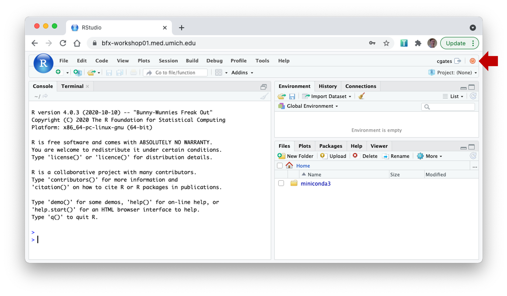

<style type="text/css">
body{ /* Normal  */
      font-size: 14pt;
  }
</style>

This document guides you through the installation of software necessary
to participate in the workshop. To complete
this setup, you will need:

-   A Macintosh or Windows workstation connected to the internet.
-   An email invitation to the workshop Slack workspace.
-   An email titled **"UM BioinfCore Workshop Login"** containing your
    individual login and password for the shared workshop server
-   About 10 minutes.


## Introduction

-   The virtual workshop will be conducted using Zoom and Slack for all days.
-   Attendees will use their own workstation/laptop to participate; the
    workstation/laptop should have a microphone, camera, and reliable
    internet access. While not required, for laptop users we recommend using a
    larger monitor for the optimal workshop experience.
-   The workshop will use Slack for group messaging. Messages posted to the
    general channel will be visible to all participants in the workshop.
-   For simplicity, participants will log in to a pre-built server which
    has the necessary data, software, and configuration already installed.
-   While not required or recommended, advanced users may elect to install some software
    locally; see [advanced setup instructions](setup_instructions_advanced.html).

## How to get help

While we have endeavored to make this setup process work robust and
comprehensive, installing bioinformatics software is tricky and we would
be happy to lend a hand to get things working.

-   If you have problems/questions, please don't hesitate to email us
    at:
    [bioinformatics-workshops@umich.edu](mailto:bioinformatics-workshops@umich.edu)

-   When emailing it will speed things along if you could include:
    -   Whether you are using Windows or Mac (and optionally which
        version of the OS you are using).
    -   Whether you have Administrative privileges on your workstation.
    -   The specific text of any error messages, if applicable.

## Setup steps

### **Zoom**

   If you have not used Zoom before, please use the following link to
   install "Zoom client for Meetings"\
   https://zoom.us/download

   - Additional Zoom settings for Macintosh:

     1.1  To enable screen sharing (useful for breakout rooms and tech support)

        - System Preferences \>\> Security & Privacy: click on the Privacy tab
        - Select **Screen Recording** on left tab
        - Scroll to the bottom of the right tab and verify **Zoom** is checked.

     1.2.  To enable remote control (useful for breakout rooms and tech support)

        - System Preferences \>\> Security & Privacy: click on the Privacy tab
        - Select **Accessibility** on left tab
        - Scroll to the bottom on the right tab and verify **Zoom** is checked.
        - If it's not checked, click the lower left lock icon and enter
            user password when prompted. You can now check Zoom in the
            right tab.
        - Click the lock again.

      1.3.  Close and relaunch Zoom client.

### **Slack**

   2.1. In the Slack email invitation from the hosts, click the link to join the Slack workspace.

   2.2. Follow the Slack instructions to login or create an account. You may
      edit your profile to add a photo if you choose.

   2.3. Note that once your Slack account is established and you have accepted the
      Slack invite you can access the Slack channel by pointing your web browser
      here: https://umbioinfcoreworkshops.slack.com

### **Launch a command window**

   - If you are using Windows:

     - Press **Windows Key + R** to launch a command window. Make sure the `Open` field says `cmd` and click OK.

     - You will see a new command window containing something like this
     (yours may have more text and the last line may look a bit different;
     that's ok)

        ```
        Microsoft Windows [Version 10.0.17763.1935]
       (c) 2018 Microsoft Corporation. All rights reserved.

        H:\>
        ```

   - If you are using a Mac:

     - Macintosh OSX has a built in command window called **Terminal**. Press
       **Command + Space** to launch Spotlight. In the search field, type
       "Terminal" and double-click on the top result.

     - You will see a new Terminal window containing something like this
       (your may have more text and the last line may look a bit different;
       that's ok)

       ```
       Last login: Feb 10 12:44:03 on ttys003\
       MacBook: \~ your_username\$
       ```

### **Login to the shared server**

   4.1. In the command window, type the following
      command, replacing the **YOUR_USERNAME** with the username supplied to you by
      the workshop hosts; hit **Enter or Return** to execute the command.<br/>
      *Note: you can copy the command below to the clipboard and then
      right-click in the command window to paste.*

        ssh YOUR_USERNAME@bfx-workshop01.med.umich.edu


   4.2. The first time you run this command, you may see a prompt like the
   following; type **yes** and hit **Enter/Return** to continue.

      The authenticity of host '...' can't be established.
      ECDSA key fingerprint is SHA256:nz9lJaGEI5QFy7....
      Are you sure you want to continue connecting (yes/no/[fingerprint])? yes

   The command will print a warning (e.g. `Warning: Permanently added
   ‘SERVER_ADDRESS’ (ECDSA) to the list of known hosts`). This is fine.

   4.3. When prompted,  type the password supplied by the workshop hosts followed
   by **Enter/Return**. (Note that the password is case sensitive. Also note that the server will not echo any characters when you are typing your password; this is ok.)

   After successfully logging in, your command window should end looking something like this:

       ------------------------------------
       Welcome to Computational Foundations
       ------------------------------------
       YOUR_USERNAME@cf: $

   If you see the text above, you have successfully logged into the shared server. 
   (You can close this window by typing **exit** or simply closing the 
   command window.)


### **Launch R/RStudio (from the web)**

  5.1 Open the following web address: <https://bfx-workshop01.med.umich.edu/>

  5.2 When prompted, enter the  username and password supplied by your hosts and
   click **Sign In**. (Same username and password as the step above.)

   You should see a new webpage that looks like something like this:

   

   If you see a screen like that above, you have successfully logged into RStudio.

## Congratulations
Your workstation and logins are ready for the workshop; thank you for
   taking time to set this up in advance.

   - You can close the command window by typing **exit** <Return/Enter> or simply closing the window.
   - You can close your RStudio session by clicking the small orange "power"
     button in the top-right corner (highlighted in the picture above by a red
     arrow).  The webpage will announce **R Session Ended**; you may now close
     the web page.

### A note on the shared compute environment

Please note that this environment is optimized for the exercises in this
particular workshop but is likely unsuitable for analyzing your own
datasets. In particular:
- It is not sized for compute intensive operations or large storage.
- It is not secured for sensitive data of any kind.
- This environment is temporary and will be removed shortly after the
  conclusion of the workshop.

If you had problems or questions about the installation steps
please see the **[How to get help](#how-to-get-help)** section above for
more assistance.
